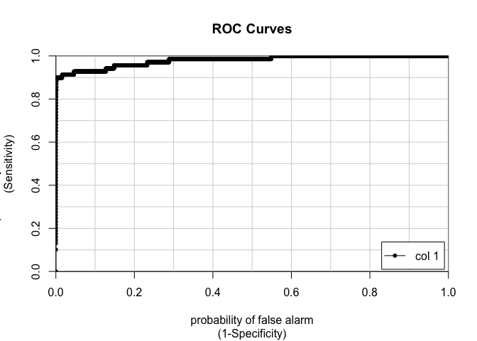
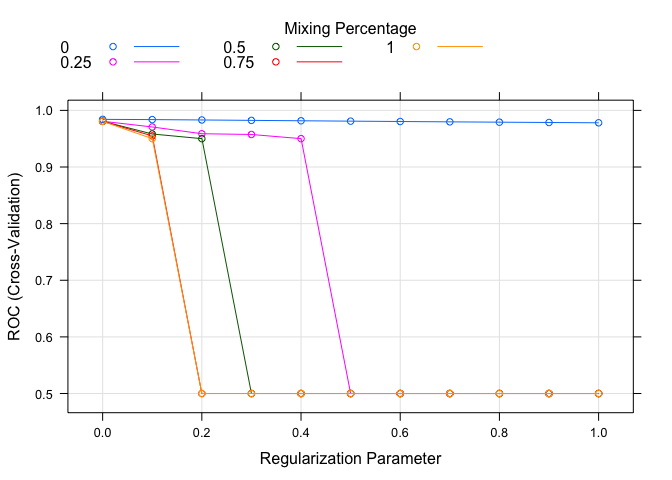
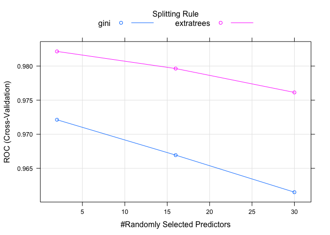
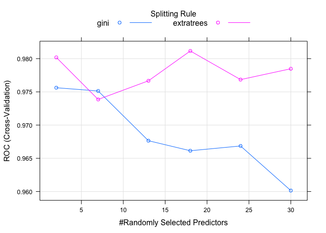
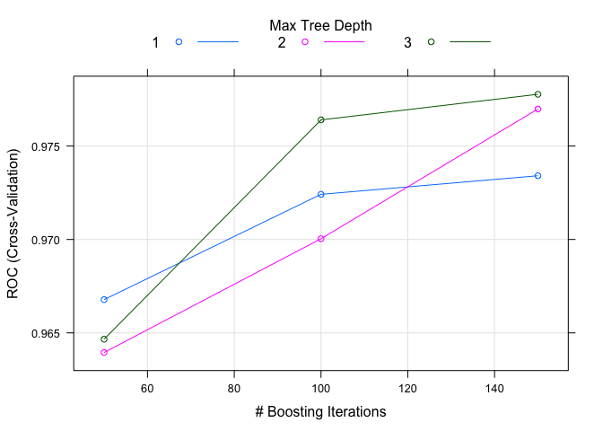
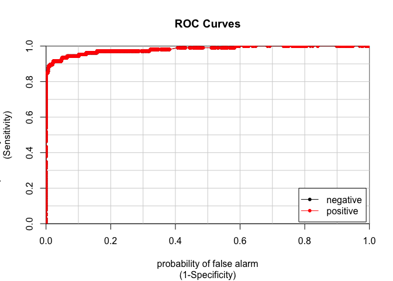
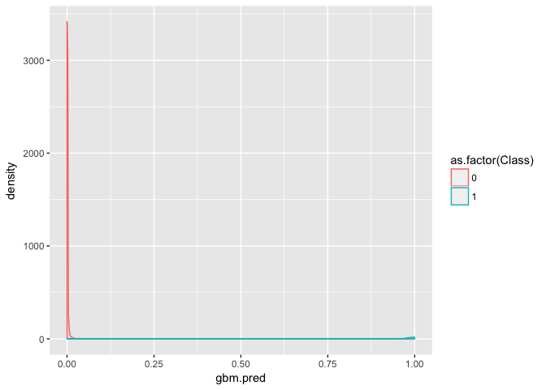

-   [<span style="color:blue">*Introduction*</span>](#introduction)
    -   [<span style="color:blue">*Exploring the Data Set*</span>](#exploring-the-data-set)
-   [<span style="color:blue">*Preparing the dataset*</span>](#preparing-the-dataset)
    -   [<span style="color:blue">*Splitting the data into Train-Validation and Test Sets:*</span>](#splitting-the-data-into-train-validation-and-test-sets)
    -   [<span style="color:blue">*Using cross-validation method:*</span>](#using-cross-validation-method)
-   [<span style="color:blue">*Fitting models using Logistic Regression, Random Forest and GBM models*</span>](#fitting-models-using-logistic-regression-random-forest-and-gbm-models)
    -   [<span style="color:red">*Fitting models using Logistic Regression *</span>](#fitting-models-using-logistic-regression)
    -   [<span style="color:blue">*Comparison of the models:*</span>](#comparison-of-the-models)
-   [<span style="color:blue">*Conclusion*</span>](#conclusion)

<span style="color:blue">*Introduction*</span>
----------------------------------------------

In this work, our aim is to do classification analysis using logistic regression, random forest, and gbm models on the dataset `creditcard`. We are going to tune the models to improve the results. The dataset we will study can be obtained from <https://www.kaggle.com/mlg-ulb/creditcardfraud>

### <span style="color:blue">*Exploring the Data Set*</span>

First let's read the data `creditcard.csv` and explore the data.

``` r
#  Do not change the code in this chunk!
creditcard_data <- read.csv('creditcard.csv')
dim(creditcard_data)
```

    ## [1] 284807     31

We have 284807 observations and 31 variables.

``` r
library(dplyr)
```

    ## 
    ## Attaching package: 'dplyr'

    ## The following objects are masked from 'package:stats':
    ## 
    ##     filter, lag

    ## The following objects are masked from 'package:base':
    ## 
    ##     intersect, setdiff, setequal, union

``` r
glimpse(creditcard_data )
```

    ## Observations: 284,807
    ## Variables: 31
    ## $ Time   <dbl> 0, 0, 1, 1, 2, 2, 4, 7, 7, 9, 10, 10, 10, 11, 12, 12, 1...
    ## $ V1     <dbl> -1.3598071, 1.1918571, -1.3583541, -0.9662717, -1.15823...
    ## $ V2     <dbl> -0.07278117, 0.26615071, -1.34016307, -0.18522601, 0.87...
    ## $ V3     <dbl> 2.53634674, 0.16648011, 1.77320934, 1.79299334, 1.54871...
    ## $ V4     <dbl> 1.37815522, 0.44815408, 0.37977959, -0.86329128, 0.4030...
    ## $ V5     <dbl> -0.33832077, 0.06001765, -0.50319813, -0.01030888, -0.4...
    ## $ V6     <dbl> 0.46238778, -0.08236081, 1.80049938, 1.24720317, 0.0959...
    ## $ V7     <dbl> 0.239598554, -0.078802983, 0.791460956, 0.237608940, 0....
    ## $ V8     <dbl> 0.098697901, 0.085101655, 0.247675787, 0.377435875, -0....
    ## $ V9     <dbl> 0.3637870, -0.2554251, -1.5146543, -1.3870241, 0.817739...
    ## $ V10    <dbl> 0.09079417, -0.16697441, 0.20764287, -0.05495192, 0.753...
    ## $ V11    <dbl> -0.55159953, 1.61272666, 0.62450146, -0.22648726, -0.82...
    ## $ V12    <dbl> -0.61780086, 1.06523531, 0.06608369, 0.17822823, 0.5381...
    ## $ V13    <dbl> -0.99138985, 0.48909502, 0.71729273, 0.50775687, 1.3458...
    ## $ V14    <dbl> -0.31116935, -0.14377230, -0.16594592, -0.28792375, -1....
    ## $ V15    <dbl> 1.468176972, 0.635558093, 2.345864949, -0.631418118, 0....
    ## $ V16    <dbl> -0.47040053, 0.46391704, -2.89008319, -1.05964725, -0.4...
    ## $ V17    <dbl> 0.207971242, -0.114804663, 1.109969379, -0.684092786, -...
    ## $ V18    <dbl> 0.02579058, -0.18336127, -0.12135931, 1.96577500, -0.03...
    ## $ V19    <dbl> 0.40399296, -0.14578304, -2.26185710, -1.23262197, 0.80...
    ## $ V20    <dbl> 0.25141210, -0.06908314, 0.52497973, -0.20803778, 0.408...
    ## $ V21    <dbl> -0.018306778, -0.225775248, 0.247998153, -0.108300452, ...
    ## $ V22    <dbl> 0.277837576, -0.638671953, 0.771679402, 0.005273597, 0....
    ## $ V23    <dbl> -0.110473910, 0.101288021, 0.909412262, -0.190320519, -...
    ## $ V24    <dbl> 0.06692807, -0.33984648, -0.68928096, -1.17557533, 0.14...
    ## $ V25    <dbl> 0.12853936, 0.16717040, -0.32764183, 0.64737603, -0.206...
    ## $ V26    <dbl> -0.18911484, 0.12589453, -0.13909657, -0.22192884, 0.50...
    ## $ V27    <dbl> 0.133558377, -0.008983099, -0.055352794, 0.062722849, 0...
    ## $ V28    <dbl> -0.021053053, 0.014724169, -0.059751841, 0.061457629, 0...
    ## $ Amount <dbl> 149.62, 2.69, 378.66, 123.50, 69.99, 3.67, 4.99, 40.80,...
    ## $ Class  <int> 0, 0, 0, 0, 0, 0, 0, 0, 0, 0, 0, 0, 0, 0, 0, 0, 0, 0, 0...

All the variables are numerical but the variable `Class`. Our aim is to predict the variable `Class`. (takes the value 1 if the transaction is fraud, otherwise 0). The classes are "0" and "1". Here is the table for the counts.

``` r
table(creditcard_data$Class) 
```

    ## 
    ##      0      1 
    ## 284315    492

As observed, the data is very unbalanced. The size of the data is also big and since our purpose is to understand and apply models, we will work on a smaller size. However, we will keep the full data with `Class=1` to make it less unbalanced.

``` r
creditcard_small_class0<-creditcard_data%>%
  filter(Class==0)%>%
  sample_n(size=20000)
```

``` r
creditcard_class1<-creditcard_data%>%
  filter(Class==1)
```

Now let's sum the `creditcard_small` and the data that has `Class=1`.

``` r
creditcard_small<-rbind(creditcard_small_class0,creditcard_class1)
```

Now let's check if we have 20000 obervations with `Class=0` and 492 observations with `Class=1`.

``` r
table(creditcard_small$Class)
```

    ## 
    ##     0     1 
    ## 20000   492

<span style="color:blue">*Preparing the dataset*</span>
-------------------------------------------------------

In order to prevent overfitting, and compare models we split our data set into train-validation and test sets. We also use cross-validation in the models we will present here.

### <span style="color:blue">*Splitting the data into Train-Validation and Test Sets:*</span>

Since we are going to compare models and select the best model at the end of the section, we will split our data into training and testing (80/20). Then we will split the training data into training and validation (again, 80/20).

Below is the R-code that helps us to split our data set into two sets: Training and Testing data.

``` r
set.seed(123)
rows <- sample(nrow(creditcard_small)) #randomly order the sampled data
creditcard_small <- creditcard_small[rows, ]
split <- round(nrow(creditcard_small) * .80)
train <- creditcard_small[1:split, ]
test.set <- creditcard_small[(split + 1):nrow(creditcard_small), ]
```

Now, we split our Training Data into two sets: Training and Validation data.

``` r
set.seed(123)
rows <- sample(nrow(train)) #randomly order the sampled data
train <- train[rows, ]
split <- round(nrow(train) * .80)
train.set <- train[1:split, ]
validation.set <- train[(split + 1):nrow(train), ]
```

In short, we have three sets now: `train.set` which has 64% of the data, `validation.set` which has 16% of the data and `test.set` which has the 20% of the data.

``` r
print(dim(train.set))  #64% of the data set
```

    ## [1] 13115    31

``` r
print(dim(validation.set)) # 16% of the data set
```

    ## [1] 3279   31

``` r
print(dim(test.set))  # 20% of the data set
```

    ## [1] 4098   31

``` r
table(train.set$Class)
```

    ## 
    ##     0     1 
    ## 12798   317

``` r
table(validation.set$Class)
```

    ## 
    ##    0    1 
    ## 3210   69

``` r
table(test.set$Class)
```

    ## 
    ##    0    1 
    ## 3992  106

### <span style="color:blue">*Using cross-validation method:*</span>

We need `caret` package in order to use cross-validation technique. Here is the R-code we use. We pick number of folders as 5. One can take cv number as 10, too. (Since 5 and 10 are the most used ones.)

``` r
library(caret)
```

    ## Loading required package: lattice

    ## Loading required package: ggplot2

``` r
myControl <- trainControl(
  method = "cv",
  number = 5,
  summaryFunction = twoClassSummary,
  classProbs = TRUE, # IMPORTANT!
  verboseIter = TRUE
)
```

Note that we apply cross-validation on the `nhanes`-`test.set`, that is the union of train.set and the validation.set. There is no need for the validation since cross-validation method does it for us.

``` r
creditcard_cv<-rbind(train.set,validation.set)
dim(creditcard_cv)
```

    ## [1] 16394    31

<span style="color:blue">*Fitting models using Logistic Regression, Random Forest and GBM models*</span>
--------------------------------------------------------------------------------------------------------

Our aim is to write models that will predict the variable `Class`. We will do classifications. We will work on logistic regression, random forest, and gbm models respectively.

### <span style="color:red">*Fitting models using Logistic Regression *</span>

First, we will start with the basic model: `glm` model for the logistic regression. Following this, we will use `glmnet` since it has hyperparameters we can play.

#### <span style="color:red">*Using `glm` model:*</span>

In this section, we fit `glm` model to our training data `train.set`. First we change our response variable `Class` to a factor variable. This is necessary for the `glm` model.

``` r
train.set$Class<-as.factor(train.set$Class)
```

Our first `glm` model will the basic one, all the variables will be included in the model as follows:

``` r
glm_model_1<-glm(Class ~ ., data = train.set, family = binomial(link = "logit"))
```

    ## Warning: glm.fit: fitted probabilities numerically 0 or 1 occurred

``` r
summary(glm_model_1)
```

    ## 
    ## Call:
    ## glm(formula = Class ~ ., family = binomial(link = "logit"), data = train.set)
    ## 
    ## Deviance Residuals: 
    ##     Min       1Q   Median       3Q      Max  
    ## -4.0715  -0.0724  -0.0437  -0.0261   4.0337  
    ## 
    ## Coefficients:
    ##               Estimate Std. Error z value Pr(>|z|)    
    ## (Intercept) -6.715e+00  5.055e-01 -13.285  < 2e-16 ***
    ## Time        -3.498e-06  4.419e-06  -0.792 0.428591    
    ## V1           3.000e-01  1.121e-01   2.676 0.007457 ** 
    ## V2          -6.943e-02  1.973e-01  -0.352 0.724957    
    ## V3          -6.068e-02  1.134e-01  -0.535 0.592464    
    ## V4           8.688e-01  1.383e-01   6.281 3.37e-10 ***
    ## V5           1.503e-01  1.639e-01   0.917 0.359070    
    ## V6          -2.581e-01  1.546e-01  -1.670 0.094918 .  
    ## V7          -4.826e-02  1.837e-01  -0.263 0.792758    
    ## V8          -4.615e-01  9.358e-02  -4.932 8.14e-07 ***
    ## V9          -2.652e-01  2.051e-01  -1.293 0.195997    
    ## V10         -6.058e-01  2.135e-01  -2.837 0.004553 ** 
    ## V11          2.321e-01  1.572e-01   1.476 0.139907    
    ## V12         -5.924e-01  1.571e-01  -3.771 0.000163 ***
    ## V13         -4.520e-01  1.449e-01  -3.119 0.001816 ** 
    ## V14         -9.301e-01  1.489e-01  -6.246 4.21e-10 ***
    ## V15         -1.720e-01  1.602e-01  -1.073 0.283055    
    ## V16         -2.792e-01  2.413e-01  -1.157 0.247296    
    ## V17         -2.201e-01  1.636e-01  -1.345 0.178583    
    ## V18         -1.816e-01  2.416e-01  -0.752 0.452139    
    ## V19          2.906e-01  2.025e-01   1.435 0.151217    
    ## V20         -2.665e-02  2.621e-01  -0.102 0.919040    
    ## V21          3.475e-01  1.237e-01   2.810 0.004961 ** 
    ## V22          5.345e-01  2.474e-01   2.161 0.030732 *  
    ## V23         -1.767e-01  1.867e-01  -0.946 0.344116    
    ## V24          2.037e-01  2.880e-01   0.707 0.479296    
    ## V25         -4.711e-02  2.683e-01  -0.176 0.860627    
    ## V26         -6.160e-01  3.810e-01  -1.617 0.105899    
    ## V27          2.446e-02  3.769e-01   0.065 0.948268    
    ## V28          2.534e-01  4.228e-01   0.599 0.548854    
    ## Amount       8.266e-04  1.756e-03   0.471 0.637854    
    ## ---
    ## Signif. codes:  0 '***' 0.001 '**' 0.01 '*' 0.05 '.' 0.1 ' ' 1
    ## 
    ## (Dispersion parameter for binomial family taken to be 1)
    ## 
    ##     Null deviance: 2986.41  on 13114  degrees of freedom
    ## Residual deviance:  526.38  on 13084  degrees of freedom
    ## AIC: 588.38
    ## 
    ## Number of Fisher Scoring iterations: 10

In our first `glm` model, we have AIC as 601.83. We would like to calculate AUC on the `validation.set` as follows:

``` r
glm.probs.1 <- predict(glm_model_1, newdata=validation.set, type="response")  #probability scale
glm.pred.1 <- ifelse(glm.probs.1 > 0.5, 1, 0)
Class_validation <- validation.set$Class
caret::confusionMatrix(as.factor(glm.pred.1),as.factor(Class_validation))
```

    ## Confusion Matrix and Statistics
    ## 
    ##           Reference
    ## Prediction    0    1
    ##          0 3206    9
    ##          1    4   60
    ##                                           
    ##                Accuracy : 0.996           
    ##                  95% CI : (0.9932, 0.9979)
    ##     No Information Rate : 0.979           
    ##     P-Value [Acc > NIR] : <2e-16          
    ##                                           
    ##                   Kappa : 0.9002          
    ##  Mcnemar's Test P-Value : 0.2673          
    ##                                           
    ##             Sensitivity : 0.9988          
    ##             Specificity : 0.8696          
    ##          Pos Pred Value : 0.9972          
    ##          Neg Pred Value : 0.9375          
    ##              Prevalence : 0.9790          
    ##          Detection Rate : 0.9777          
    ##    Detection Prevalence : 0.9805          
    ##       Balanced Accuracy : 0.9342          
    ##                                           
    ##        'Positive' Class : 0               
    ## 

``` r
caTools::colAUC(glm.probs.1,  validation.set$Class, plotROC = TRUE)
```



    ##              [,1]
    ## 0 vs. 1 0.9794167

The AUC for this first model is 0.9857963.

#### <span style="color:red">*Using `glm` model and Cross-Validation:*</span>

Now, intead of dividing our data set into train and validation set, let's work on a glm model using cross-validation. We did define myControl in section: Preparing the Data. We will use my Control as `trControl`.

``` r
creditcard_cv$Class<-as.factor(creditcard_cv$Class)
levels(creditcard_cv$Class) <- c("negative", "positive")
set.seed(1)
glm_model_cv <- train(Class ~.,creditcard_cv, method = "glm",
  trControl = myControl)
```

    ## Warning in train.default(x, y, weights = w, ...): The metric "Accuracy" was
    ## not in the result set. ROC will be used instead.

    ## + Fold1: parameter=none

    ## Warning: glm.fit: fitted probabilities numerically 0 or 1 occurred

    ## - Fold1: parameter=none 
    ## + Fold2: parameter=none

    ## Warning: glm.fit: fitted probabilities numerically 0 or 1 occurred

    ## - Fold2: parameter=none 
    ## + Fold3: parameter=none

    ## Warning: glm.fit: fitted probabilities numerically 0 or 1 occurred

    ## - Fold3: parameter=none 
    ## + Fold4: parameter=none

    ## Warning: glm.fit: fitted probabilities numerically 0 or 1 occurred

    ## - Fold4: parameter=none 
    ## + Fold5: parameter=none

    ## Warning: glm.fit: fitted probabilities numerically 0 or 1 occurred

    ## - Fold5: parameter=none 
    ## Aggregating results
    ## Fitting final model on full training set

    ## Warning: glm.fit: fitted probabilities numerically 0 or 1 occurred

``` r
glm_model_cv
```

    ## Generalized Linear Model 
    ## 
    ## 16394 samples
    ##    30 predictor
    ##     2 classes: 'negative', 'positive' 
    ## 
    ## No pre-processing
    ## Resampling: Cross-Validated (5 fold) 
    ## Summary of sample sizes: 13114, 13115, 13116, 13115, 13116 
    ## Resampling results:
    ## 
    ##   ROC        Sens       Spec     
    ##   0.9801212  0.9993753  0.8264069

The AUC for our second model is 0.9760535.

#### <span style="color:red">*Using `glmnet` Model: *</span>

We fit the `glmnet model` using the R-code below. We also pick hyperparameters as *α* ∈ {0, 0.25, 0.5, 0.75, 1} where *α* is the elasticnet mixing parameter. Note that *α* = 1 is the lasso penalty, and *α* = 0 the ridge penalty. We will take *λ* ∈ {0, 1, 2, ..., 10}. We will use cross-validation again.

``` r
library(glmnet)
```

    ## Loading required package: Matrix

    ## Loading required package: foreach

    ## Loaded glmnet 2.0-16

``` r
set.seed(1)
model_glmnet <- train(
Class ~ ., creditcard_cv,
metric = "ROC",
method = "glmnet",
tuneGrid = expand.grid(
alpha = 0:4/4,
lambda = 0:10/10
),
trControl = myControl
)
```

    ## + Fold1: alpha=0.00, lambda=1 
    ## - Fold1: alpha=0.00, lambda=1 
    ## + Fold1: alpha=0.25, lambda=1 
    ## - Fold1: alpha=0.25, lambda=1 
    ## + Fold1: alpha=0.50, lambda=1 
    ## - Fold1: alpha=0.50, lambda=1 
    ## + Fold1: alpha=0.75, lambda=1 
    ## - Fold1: alpha=0.75, lambda=1 
    ## + Fold1: alpha=1.00, lambda=1 
    ## - Fold1: alpha=1.00, lambda=1 
    ## + Fold2: alpha=0.00, lambda=1 
    ## - Fold2: alpha=0.00, lambda=1 
    ## + Fold2: alpha=0.25, lambda=1 
    ## - Fold2: alpha=0.25, lambda=1 
    ## + Fold2: alpha=0.50, lambda=1 
    ## - Fold2: alpha=0.50, lambda=1 
    ## + Fold2: alpha=0.75, lambda=1 
    ## - Fold2: alpha=0.75, lambda=1 
    ## + Fold2: alpha=1.00, lambda=1 
    ## - Fold2: alpha=1.00, lambda=1 
    ## + Fold3: alpha=0.00, lambda=1 
    ## - Fold3: alpha=0.00, lambda=1 
    ## + Fold3: alpha=0.25, lambda=1 
    ## - Fold3: alpha=0.25, lambda=1 
    ## + Fold3: alpha=0.50, lambda=1 
    ## - Fold3: alpha=0.50, lambda=1 
    ## + Fold3: alpha=0.75, lambda=1 
    ## - Fold3: alpha=0.75, lambda=1 
    ## + Fold3: alpha=1.00, lambda=1 
    ## - Fold3: alpha=1.00, lambda=1 
    ## + Fold4: alpha=0.00, lambda=1 
    ## - Fold4: alpha=0.00, lambda=1 
    ## + Fold4: alpha=0.25, lambda=1 
    ## - Fold4: alpha=0.25, lambda=1 
    ## + Fold4: alpha=0.50, lambda=1 
    ## - Fold4: alpha=0.50, lambda=1 
    ## + Fold4: alpha=0.75, lambda=1 
    ## - Fold4: alpha=0.75, lambda=1 
    ## + Fold4: alpha=1.00, lambda=1 
    ## - Fold4: alpha=1.00, lambda=1 
    ## + Fold5: alpha=0.00, lambda=1 
    ## - Fold5: alpha=0.00, lambda=1 
    ## + Fold5: alpha=0.25, lambda=1 
    ## - Fold5: alpha=0.25, lambda=1 
    ## + Fold5: alpha=0.50, lambda=1 
    ## - Fold5: alpha=0.50, lambda=1 
    ## + Fold5: alpha=0.75, lambda=1 
    ## - Fold5: alpha=0.75, lambda=1 
    ## + Fold5: alpha=1.00, lambda=1 
    ## - Fold5: alpha=1.00, lambda=1 
    ## Aggregating results
    ## Selecting tuning parameters
    ## Fitting alpha = 0, lambda = 0 on full training set

``` r
 # Plot the results
model_glmnet
```

    ## glmnet 
    ## 
    ## 16394 samples
    ##    30 predictor
    ##     2 classes: 'negative', 'positive' 
    ## 
    ## No pre-processing
    ## Resampling: Cross-Validated (5 fold) 
    ## Summary of sample sizes: 13114, 13115, 13116, 13115, 13116 
    ## Resampling results across tuning parameters:
    ## 
    ##   alpha  lambda  ROC        Sens       Spec      
    ##   0.00   0.0     0.9841359  0.9997501  0.78488178
    ##   0.00   0.1     0.9837171  0.9999375  0.52584083
    ##   0.00   0.2     0.9830501  0.9999375  0.41438561
    ##   0.00   0.3     0.9823356  0.9999375  0.33663004
    ##   0.00   0.4     0.9816473  0.9999375  0.29520480
    ##   0.00   0.5     0.9809731  0.9999375  0.25884116
    ##   0.00   0.6     0.9803425  0.9999375  0.21481851
    ##   0.00   0.7     0.9797222  0.9999375  0.20705961
    ##   0.00   0.8     0.9791589  0.9999375  0.20705961
    ##   0.00   0.9     0.9786071  0.9999375  0.20705961
    ##   0.00   1.0     0.9780721  0.9999375  0.19926740
    ##   0.25   0.0     0.9807684  0.9994378  0.82640693
    ##   0.25   0.1     0.9706972  0.9999375  0.34182484
    ##   0.25   0.2     0.9587632  1.0000000  0.11651682
    ##   0.25   0.3     0.9574451  1.0000000  0.00000000
    ##   0.25   0.4     0.9500592  1.0000000  0.00000000
    ##   0.25   0.5     0.5000000  1.0000000  0.00000000
    ##   0.25   0.6     0.5000000  1.0000000  0.00000000
    ##   0.25   0.7     0.5000000  1.0000000  0.00000000
    ##   0.25   0.8     0.5000000  1.0000000  0.00000000
    ##   0.25   0.9     0.5000000  1.0000000  0.00000000
    ##   0.25   1.0     0.5000000  1.0000000  0.00000000
    ##   0.50   0.0     0.9806939  0.9993753  0.82640693
    ##   0.50   0.1     0.9583054  0.9999375  0.14498834
    ##   0.50   0.2     0.9500592  1.0000000  0.00000000
    ##   0.50   0.3     0.5000000  1.0000000  0.00000000
    ##   0.50   0.4     0.5000000  1.0000000  0.00000000
    ##   0.50   0.5     0.5000000  1.0000000  0.00000000
    ##   0.50   0.6     0.5000000  1.0000000  0.00000000
    ##   0.50   0.7     0.5000000  1.0000000  0.00000000
    ##   0.50   0.8     0.5000000  1.0000000  0.00000000
    ##   0.50   0.9     0.5000000  1.0000000  0.00000000
    ##   0.50   1.0     0.5000000  1.0000000  0.00000000
    ##   0.75   0.0     0.9806858  0.9993753  0.82640693
    ##   0.75   0.1     0.9549158  0.9999375  0.02074592
    ##   0.75   0.2     0.5000000  1.0000000  0.00000000
    ##   0.75   0.3     0.5000000  1.0000000  0.00000000
    ##   0.75   0.4     0.5000000  1.0000000  0.00000000
    ##   0.75   0.5     0.5000000  1.0000000  0.00000000
    ##   0.75   0.6     0.5000000  1.0000000  0.00000000
    ##   0.75   0.7     0.5000000  1.0000000  0.00000000
    ##   0.75   0.8     0.5000000  1.0000000  0.00000000
    ##   0.75   0.9     0.5000000  1.0000000  0.00000000
    ##   0.75   1.0     0.5000000  1.0000000  0.00000000
    ##   1.00   0.0     0.9806314  0.9993753  0.82900433
    ##   1.00   0.1     0.9500592  1.0000000  0.00000000
    ##   1.00   0.2     0.5000000  1.0000000  0.00000000
    ##   1.00   0.3     0.5000000  1.0000000  0.00000000
    ##   1.00   0.4     0.5000000  1.0000000  0.00000000
    ##   1.00   0.5     0.5000000  1.0000000  0.00000000
    ##   1.00   0.6     0.5000000  1.0000000  0.00000000
    ##   1.00   0.7     0.5000000  1.0000000  0.00000000
    ##   1.00   0.8     0.5000000  1.0000000  0.00000000
    ##   1.00   0.9     0.5000000  1.0000000  0.00000000
    ##   1.00   1.0     0.5000000  1.0000000  0.00000000
    ## 
    ## ROC was used to select the optimal model using the largest value.
    ## The final values used for the model were alpha = 0 and lambda = 0.

``` r
plot(model_glmnet)
```

 As seen in the ROC vs Regulalarization Parameter plot above, we see that max ROC occurs at `alpha`=0 and `lambda`=0. With this values, we write `model_glmnet_optimal` as below:

``` r
set.seed(1)
model_glmnet_optimal <- train(
Class ~ ., creditcard_cv,
metric = "ROC",
method = "glmnet",
tuneGrid = expand.grid(
alpha = 0,
lambda = 0
),
trControl = myControl
)
```

    ## + Fold1: alpha=0, lambda=0 
    ## - Fold1: alpha=0, lambda=0 
    ## + Fold2: alpha=0, lambda=0 
    ## - Fold2: alpha=0, lambda=0 
    ## + Fold3: alpha=0, lambda=0 
    ## - Fold3: alpha=0, lambda=0 
    ## + Fold4: alpha=0, lambda=0 
    ## - Fold4: alpha=0, lambda=0 
    ## + Fold5: alpha=0, lambda=0 
    ## - Fold5: alpha=0, lambda=0 
    ## Aggregating results
    ## Fitting final model on full training set

``` r
model_glmnet_optimal
```

    ## glmnet 
    ## 
    ## 16394 samples
    ##    30 predictor
    ##     2 classes: 'negative', 'positive' 
    ## 
    ## No pre-processing
    ## Resampling: Cross-Validated (5 fold) 
    ## Summary of sample sizes: 13114, 13115, 13116, 13115, 13116 
    ## Resampling results:
    ## 
    ##   ROC        Sens       Spec     
    ##   0.9841359  0.9997501  0.7848818
    ## 
    ## Tuning parameter 'alpha' was held constant at a value of 0
    ## 
    ## Tuning parameter 'lambda' was held constant at a value of 0

The AUC for this third model is 0.9806987.

#### <span style="color:green">*Using Random Forest Model: *</span>

We are going to use `ranger` as a random forest model.

``` r
set.seed(1)
model_rf <- train(
Class ~ ., creditcard_cv,
metric = "ROC",
method = "ranger",
trControl = myControl
)
```

    ## + Fold1: mtry= 2, min.node.size=1, splitrule=gini 
    ## - Fold1: mtry= 2, min.node.size=1, splitrule=gini 
    ## + Fold1: mtry=16, min.node.size=1, splitrule=gini 
    ## - Fold1: mtry=16, min.node.size=1, splitrule=gini 
    ## + Fold1: mtry=30, min.node.size=1, splitrule=gini 
    ## - Fold1: mtry=30, min.node.size=1, splitrule=gini 
    ## + Fold1: mtry= 2, min.node.size=1, splitrule=extratrees 
    ## - Fold1: mtry= 2, min.node.size=1, splitrule=extratrees 
    ## + Fold1: mtry=16, min.node.size=1, splitrule=extratrees 
    ## - Fold1: mtry=16, min.node.size=1, splitrule=extratrees 
    ## + Fold1: mtry=30, min.node.size=1, splitrule=extratrees 
    ## - Fold1: mtry=30, min.node.size=1, splitrule=extratrees 
    ## + Fold2: mtry= 2, min.node.size=1, splitrule=gini 
    ## - Fold2: mtry= 2, min.node.size=1, splitrule=gini 
    ## + Fold2: mtry=16, min.node.size=1, splitrule=gini 
    ## - Fold2: mtry=16, min.node.size=1, splitrule=gini 
    ## + Fold2: mtry=30, min.node.size=1, splitrule=gini 
    ## - Fold2: mtry=30, min.node.size=1, splitrule=gini 
    ## + Fold2: mtry= 2, min.node.size=1, splitrule=extratrees 
    ## - Fold2: mtry= 2, min.node.size=1, splitrule=extratrees 
    ## + Fold2: mtry=16, min.node.size=1, splitrule=extratrees 
    ## - Fold2: mtry=16, min.node.size=1, splitrule=extratrees 
    ## + Fold2: mtry=30, min.node.size=1, splitrule=extratrees 
    ## - Fold2: mtry=30, min.node.size=1, splitrule=extratrees 
    ## + Fold3: mtry= 2, min.node.size=1, splitrule=gini 
    ## - Fold3: mtry= 2, min.node.size=1, splitrule=gini 
    ## + Fold3: mtry=16, min.node.size=1, splitrule=gini 
    ## - Fold3: mtry=16, min.node.size=1, splitrule=gini 
    ## + Fold3: mtry=30, min.node.size=1, splitrule=gini 
    ## - Fold3: mtry=30, min.node.size=1, splitrule=gini 
    ## + Fold3: mtry= 2, min.node.size=1, splitrule=extratrees 
    ## - Fold3: mtry= 2, min.node.size=1, splitrule=extratrees 
    ## + Fold3: mtry=16, min.node.size=1, splitrule=extratrees 
    ## - Fold3: mtry=16, min.node.size=1, splitrule=extratrees 
    ## + Fold3: mtry=30, min.node.size=1, splitrule=extratrees 
    ## - Fold3: mtry=30, min.node.size=1, splitrule=extratrees 
    ## + Fold4: mtry= 2, min.node.size=1, splitrule=gini 
    ## - Fold4: mtry= 2, min.node.size=1, splitrule=gini 
    ## + Fold4: mtry=16, min.node.size=1, splitrule=gini 
    ## - Fold4: mtry=16, min.node.size=1, splitrule=gini 
    ## + Fold4: mtry=30, min.node.size=1, splitrule=gini 
    ## - Fold4: mtry=30, min.node.size=1, splitrule=gini 
    ## + Fold4: mtry= 2, min.node.size=1, splitrule=extratrees 
    ## - Fold4: mtry= 2, min.node.size=1, splitrule=extratrees 
    ## + Fold4: mtry=16, min.node.size=1, splitrule=extratrees 
    ## - Fold4: mtry=16, min.node.size=1, splitrule=extratrees 
    ## + Fold4: mtry=30, min.node.size=1, splitrule=extratrees 
    ## - Fold4: mtry=30, min.node.size=1, splitrule=extratrees 
    ## + Fold5: mtry= 2, min.node.size=1, splitrule=gini 
    ## - Fold5: mtry= 2, min.node.size=1, splitrule=gini 
    ## + Fold5: mtry=16, min.node.size=1, splitrule=gini 
    ## - Fold5: mtry=16, min.node.size=1, splitrule=gini 
    ## + Fold5: mtry=30, min.node.size=1, splitrule=gini 
    ## - Fold5: mtry=30, min.node.size=1, splitrule=gini 
    ## + Fold5: mtry= 2, min.node.size=1, splitrule=extratrees 
    ## - Fold5: mtry= 2, min.node.size=1, splitrule=extratrees 
    ## + Fold5: mtry=16, min.node.size=1, splitrule=extratrees 
    ## - Fold5: mtry=16, min.node.size=1, splitrule=extratrees 
    ## + Fold5: mtry=30, min.node.size=1, splitrule=extratrees 
    ## - Fold5: mtry=30, min.node.size=1, splitrule=extratrees 
    ## Aggregating results
    ## Selecting tuning parameters
    ## Fitting mtry = 2, splitrule = extratrees, min.node.size = 1 on full training set

``` r
plot(model_rf)
```



``` r
model_rf
```

    ## Random Forest 
    ## 
    ## 16394 samples
    ##    30 predictor
    ##     2 classes: 'negative', 'positive' 
    ## 
    ## No pre-processing
    ## Resampling: Cross-Validated (5 fold) 
    ## Summary of sample sizes: 13114, 13115, 13116, 13115, 13116 
    ## Resampling results across tuning parameters:
    ## 
    ##   mtry  splitrule   ROC        Sens       Spec     
    ##    2    gini        0.9721237  0.9996877  0.8341658
    ##    2    extratrees  0.9821501  0.9996877  0.8107892
    ##   16    gini        0.9669352  0.9995003  0.8419580
    ##   16    extratrees  0.9796336  0.9996877  0.8419580
    ##   30    gini        0.9614973  0.9995003  0.8316017
    ##   30    extratrees  0.9761319  0.9996877  0.8445554
    ## 
    ## Tuning parameter 'min.node.size' was held constant at a value of 1
    ## ROC was used to select the optimal model using the largest value.
    ## The final values used for the model were mtry = 2, splitrule =
    ##  extratrees and min.node.size = 1.

The random forest model with the maximum `AUC` = 0.9774700 has sensitivity 0.9996251 and specificity 0.8366764. For this model `mtry`=16 and `splitrule` is `extratrees`.

#### <span style="color:green">*Tuning the Random Forest Model: *</span>

In the `ranger` method, the default value for the tuneLength is 3. That's why we got three mtry values (`mtry`=2,`mtry`=16 and `mtry`=30) for the model `model_rf`. Below we will pick our `tuneLength` as 6 hoping to improve the results.

``` r
library(mlbench)
set.seed(1)
model_rf_tuned <- train(
Class ~ ., creditcard_cv,
metric = "ROC",
method = "ranger",
trControl = myControl,
tuneLength = 6
)
```

    ## + Fold1: mtry= 2, min.node.size=1, splitrule=gini 
    ## - Fold1: mtry= 2, min.node.size=1, splitrule=gini 
    ## + Fold1: mtry= 7, min.node.size=1, splitrule=gini 
    ## - Fold1: mtry= 7, min.node.size=1, splitrule=gini 
    ## + Fold1: mtry=13, min.node.size=1, splitrule=gini 
    ## - Fold1: mtry=13, min.node.size=1, splitrule=gini 
    ## + Fold1: mtry=18, min.node.size=1, splitrule=gini 
    ## - Fold1: mtry=18, min.node.size=1, splitrule=gini 
    ## + Fold1: mtry=24, min.node.size=1, splitrule=gini 
    ## - Fold1: mtry=24, min.node.size=1, splitrule=gini 
    ## + Fold1: mtry=30, min.node.size=1, splitrule=gini 
    ## - Fold1: mtry=30, min.node.size=1, splitrule=gini 
    ## + Fold1: mtry= 2, min.node.size=1, splitrule=extratrees 
    ## - Fold1: mtry= 2, min.node.size=1, splitrule=extratrees 
    ## + Fold1: mtry= 7, min.node.size=1, splitrule=extratrees 
    ## - Fold1: mtry= 7, min.node.size=1, splitrule=extratrees 
    ## + Fold1: mtry=13, min.node.size=1, splitrule=extratrees 
    ## - Fold1: mtry=13, min.node.size=1, splitrule=extratrees 
    ## + Fold1: mtry=18, min.node.size=1, splitrule=extratrees 
    ## - Fold1: mtry=18, min.node.size=1, splitrule=extratrees 
    ## + Fold1: mtry=24, min.node.size=1, splitrule=extratrees 
    ## - Fold1: mtry=24, min.node.size=1, splitrule=extratrees 
    ## + Fold1: mtry=30, min.node.size=1, splitrule=extratrees 
    ## - Fold1: mtry=30, min.node.size=1, splitrule=extratrees 
    ## + Fold2: mtry= 2, min.node.size=1, splitrule=gini 
    ## - Fold2: mtry= 2, min.node.size=1, splitrule=gini 
    ## + Fold2: mtry= 7, min.node.size=1, splitrule=gini 
    ## - Fold2: mtry= 7, min.node.size=1, splitrule=gini 
    ## + Fold2: mtry=13, min.node.size=1, splitrule=gini 
    ## - Fold2: mtry=13, min.node.size=1, splitrule=gini 
    ## + Fold2: mtry=18, min.node.size=1, splitrule=gini 
    ## - Fold2: mtry=18, min.node.size=1, splitrule=gini 
    ## + Fold2: mtry=24, min.node.size=1, splitrule=gini 
    ## - Fold2: mtry=24, min.node.size=1, splitrule=gini 
    ## + Fold2: mtry=30, min.node.size=1, splitrule=gini 
    ## - Fold2: mtry=30, min.node.size=1, splitrule=gini 
    ## + Fold2: mtry= 2, min.node.size=1, splitrule=extratrees 
    ## - Fold2: mtry= 2, min.node.size=1, splitrule=extratrees 
    ## + Fold2: mtry= 7, min.node.size=1, splitrule=extratrees 
    ## - Fold2: mtry= 7, min.node.size=1, splitrule=extratrees 
    ## + Fold2: mtry=13, min.node.size=1, splitrule=extratrees 
    ## - Fold2: mtry=13, min.node.size=1, splitrule=extratrees 
    ## + Fold2: mtry=18, min.node.size=1, splitrule=extratrees 
    ## - Fold2: mtry=18, min.node.size=1, splitrule=extratrees 
    ## + Fold2: mtry=24, min.node.size=1, splitrule=extratrees 
    ## - Fold2: mtry=24, min.node.size=1, splitrule=extratrees 
    ## + Fold2: mtry=30, min.node.size=1, splitrule=extratrees 
    ## - Fold2: mtry=30, min.node.size=1, splitrule=extratrees 
    ## + Fold3: mtry= 2, min.node.size=1, splitrule=gini 
    ## - Fold3: mtry= 2, min.node.size=1, splitrule=gini 
    ## + Fold3: mtry= 7, min.node.size=1, splitrule=gini 
    ## - Fold3: mtry= 7, min.node.size=1, splitrule=gini 
    ## + Fold3: mtry=13, min.node.size=1, splitrule=gini 
    ## - Fold3: mtry=13, min.node.size=1, splitrule=gini 
    ## + Fold3: mtry=18, min.node.size=1, splitrule=gini 
    ## - Fold3: mtry=18, min.node.size=1, splitrule=gini 
    ## + Fold3: mtry=24, min.node.size=1, splitrule=gini 
    ## - Fold3: mtry=24, min.node.size=1, splitrule=gini 
    ## + Fold3: mtry=30, min.node.size=1, splitrule=gini 
    ## - Fold3: mtry=30, min.node.size=1, splitrule=gini 
    ## + Fold3: mtry= 2, min.node.size=1, splitrule=extratrees 
    ## - Fold3: mtry= 2, min.node.size=1, splitrule=extratrees 
    ## + Fold3: mtry= 7, min.node.size=1, splitrule=extratrees 
    ## - Fold3: mtry= 7, min.node.size=1, splitrule=extratrees 
    ## + Fold3: mtry=13, min.node.size=1, splitrule=extratrees 
    ## - Fold3: mtry=13, min.node.size=1, splitrule=extratrees 
    ## + Fold3: mtry=18, min.node.size=1, splitrule=extratrees 
    ## - Fold3: mtry=18, min.node.size=1, splitrule=extratrees 
    ## + Fold3: mtry=24, min.node.size=1, splitrule=extratrees 
    ## - Fold3: mtry=24, min.node.size=1, splitrule=extratrees 
    ## + Fold3: mtry=30, min.node.size=1, splitrule=extratrees 
    ## - Fold3: mtry=30, min.node.size=1, splitrule=extratrees 
    ## + Fold4: mtry= 2, min.node.size=1, splitrule=gini 
    ## - Fold4: mtry= 2, min.node.size=1, splitrule=gini 
    ## + Fold4: mtry= 7, min.node.size=1, splitrule=gini 
    ## - Fold4: mtry= 7, min.node.size=1, splitrule=gini 
    ## + Fold4: mtry=13, min.node.size=1, splitrule=gini 
    ## - Fold4: mtry=13, min.node.size=1, splitrule=gini 
    ## + Fold4: mtry=18, min.node.size=1, splitrule=gini 
    ## - Fold4: mtry=18, min.node.size=1, splitrule=gini 
    ## + Fold4: mtry=24, min.node.size=1, splitrule=gini 
    ## - Fold4: mtry=24, min.node.size=1, splitrule=gini 
    ## + Fold4: mtry=30, min.node.size=1, splitrule=gini 
    ## - Fold4: mtry=30, min.node.size=1, splitrule=gini 
    ## + Fold4: mtry= 2, min.node.size=1, splitrule=extratrees 
    ## - Fold4: mtry= 2, min.node.size=1, splitrule=extratrees 
    ## + Fold4: mtry= 7, min.node.size=1, splitrule=extratrees 
    ## - Fold4: mtry= 7, min.node.size=1, splitrule=extratrees 
    ## + Fold4: mtry=13, min.node.size=1, splitrule=extratrees 
    ## - Fold4: mtry=13, min.node.size=1, splitrule=extratrees 
    ## + Fold4: mtry=18, min.node.size=1, splitrule=extratrees 
    ## - Fold4: mtry=18, min.node.size=1, splitrule=extratrees 
    ## + Fold4: mtry=24, min.node.size=1, splitrule=extratrees 
    ## - Fold4: mtry=24, min.node.size=1, splitrule=extratrees 
    ## + Fold4: mtry=30, min.node.size=1, splitrule=extratrees 
    ## - Fold4: mtry=30, min.node.size=1, splitrule=extratrees 
    ## + Fold5: mtry= 2, min.node.size=1, splitrule=gini 
    ## - Fold5: mtry= 2, min.node.size=1, splitrule=gini 
    ## + Fold5: mtry= 7, min.node.size=1, splitrule=gini 
    ## - Fold5: mtry= 7, min.node.size=1, splitrule=gini 
    ## + Fold5: mtry=13, min.node.size=1, splitrule=gini 
    ## - Fold5: mtry=13, min.node.size=1, splitrule=gini 
    ## + Fold5: mtry=18, min.node.size=1, splitrule=gini 
    ## - Fold5: mtry=18, min.node.size=1, splitrule=gini 
    ## + Fold5: mtry=24, min.node.size=1, splitrule=gini 
    ## - Fold5: mtry=24, min.node.size=1, splitrule=gini 
    ## + Fold5: mtry=30, min.node.size=1, splitrule=gini 
    ## - Fold5: mtry=30, min.node.size=1, splitrule=gini 
    ## + Fold5: mtry= 2, min.node.size=1, splitrule=extratrees 
    ## - Fold5: mtry= 2, min.node.size=1, splitrule=extratrees 
    ## + Fold5: mtry= 7, min.node.size=1, splitrule=extratrees 
    ## - Fold5: mtry= 7, min.node.size=1, splitrule=extratrees 
    ## + Fold5: mtry=13, min.node.size=1, splitrule=extratrees 
    ## - Fold5: mtry=13, min.node.size=1, splitrule=extratrees 
    ## + Fold5: mtry=18, min.node.size=1, splitrule=extratrees 
    ## - Fold5: mtry=18, min.node.size=1, splitrule=extratrees 
    ## + Fold5: mtry=24, min.node.size=1, splitrule=extratrees 
    ## - Fold5: mtry=24, min.node.size=1, splitrule=extratrees 
    ## + Fold5: mtry=30, min.node.size=1, splitrule=extratrees 
    ## - Fold5: mtry=30, min.node.size=1, splitrule=extratrees 
    ## Aggregating results
    ## Selecting tuning parameters
    ## Fitting mtry = 18, splitrule = extratrees, min.node.size = 1 on full training set

``` r
plot(model_rf_tuned)
```



``` r
model_rf_tuned
```

    ## Random Forest 
    ## 
    ## 16394 samples
    ##    30 predictor
    ##     2 classes: 'negative', 'positive' 
    ## 
    ## No pre-processing
    ## Resampling: Cross-Validated (5 fold) 
    ## Summary of sample sizes: 13114, 13115, 13116, 13115, 13116 
    ## Resampling results across tuning parameters:
    ## 
    ##   mtry  splitrule   ROC        Sens       Spec     
    ##    2    gini        0.9756217  0.9996877  0.8367632
    ##    2    extratrees  0.9801893  0.9996877  0.8081918
    ##    7    gini        0.9751344  0.9995627  0.8419580
    ##    7    extratrees  0.9738605  0.9996877  0.8315684
    ##   13    gini        0.9676489  0.9995003  0.8419580
    ##   13    extratrees  0.9766650  0.9996877  0.8419580
    ##   18    gini        0.9661375  0.9995003  0.8419580
    ##   18    extratrees  0.9811567  0.9996877  0.8419580
    ##   24    gini        0.9668565  0.9995003  0.8316017
    ##   24    extratrees  0.9768465  0.9996877  0.8445554
    ##   30    gini        0.9601437  0.9995003  0.8316017
    ##   30    extratrees  0.9784778  0.9996877  0.8445554
    ## 
    ## Tuning parameter 'min.node.size' was held constant at a value of 1
    ## ROC was used to select the optimal model using the largest value.
    ## The final values used for the model were mtry = 18, splitrule =
    ##  extratrees and min.node.size = 1.

As seen the the model used 6 values for `mtry`. (mtry ∈{2, 7, 13, 18, 24, 30}). From the plot and the model, we can tell that the model with the highest AUC= 0.9800891 has sensitivity=0.9997500 and specificity= 0.8239208. For this model mtry=7 and splitrule = extratrees and min.node.size = 1.

#### <span style="color:purple">*Using GBM Model: *</span>

In this section, we will use `caret` package again and pick the method as `gbm`. Since we have classification, we will pick bernoulli loss function. Here is the R-code for our `gbm` model:

``` r
set.seed(1)
model_gbm <- train(
Class ~ ., creditcard_cv,
metric = "ROC",
method = "gbm",
distribution="bernoulli",
trControl = myControl
)
```

    ## + Fold1: shrinkage=0.1, interaction.depth=1, n.minobsinnode=10, n.trees=150 
    ## Iter   TrainDeviance   ValidDeviance   StepSize   Improve
    ##      1        0.1046             nan     0.1000    0.0593
    ##      2        0.0993             nan     0.1000    0.0026
    ##      3        0.0945             nan     0.1000    0.0021
    ##      4        0.0905             nan     0.1000    0.0020
    ##      5        0.0867             nan     0.1000    0.0019
    ##      6        0.0837             nan     0.1000    0.0016
    ##      7        0.0810             nan     0.1000    0.0013
    ##      8        0.0778             nan     0.1000    0.0015
    ##      9        0.0759             nan     0.1000    0.0010
    ##     10        0.0733             nan     0.1000    0.0013
    ##     20        0.0582             nan     0.1000    0.0007
    ##     40        0.0486             nan     0.1000   -0.0000
    ##     60        0.0447             nan     0.1000   -0.0001
    ##     80        0.0430             nan     0.1000   -0.0001
    ##    100        0.0411             nan     0.1000    0.0000
    ##    120        0.0399             nan     0.1000   -0.0000
    ##    140        0.0394             nan     0.1000    0.0000
    ##    150        0.0391             nan     0.1000    0.0000
    ## 
    ## - Fold1: shrinkage=0.1, interaction.depth=1, n.minobsinnode=10, n.trees=150 
    ## + Fold1: shrinkage=0.1, interaction.depth=2, n.minobsinnode=10, n.trees=150 
    ## Iter   TrainDeviance   ValidDeviance   StepSize   Improve
    ##      1        0.1025             nan     0.1000    0.0539
    ##      2        0.0966             nan     0.1000    0.0031
    ##      3        0.0912             nan     0.1000    0.0025
    ##      4        0.0809             nan     0.1000    0.0048
    ##      5        0.0772             nan     0.1000    0.0018
    ##      6        0.0735             nan     0.1000    0.0018
    ##      7        0.0703             nan     0.1000    0.0015
    ##      8        0.0675             nan     0.1000    0.0013
    ##      9        0.0653             nan     0.1000    0.0011
    ##     10        0.0629             nan     0.1000    0.0011
    ##     20        0.0491             nan     0.1000    0.0005
    ##     40        0.0415             nan     0.1000    0.0001
    ##     60        0.0376             nan     0.1000   -0.0000
    ##     80        0.0347             nan     0.1000   -0.0000
    ##    100        0.0326             nan     0.1000   -0.0000
    ##    120        0.0311             nan     0.1000   -0.0000
    ##    140        0.0348             nan     0.1000    0.0000
    ##    150        0.0335             nan     0.1000   -0.0001
    ## 
    ## - Fold1: shrinkage=0.1, interaction.depth=2, n.minobsinnode=10, n.trees=150 
    ## + Fold1: shrinkage=0.1, interaction.depth=3, n.minobsinnode=10, n.trees=150 
    ## Iter   TrainDeviance   ValidDeviance   StepSize   Improve
    ##      1        0.0935             nan     0.1000    0.0619
    ##      2        0.0878             nan     0.1000    0.0028
    ##      3        0.0830             nan     0.1000    0.0024
    ##      4        0.0788             nan     0.1000    0.0020
    ##      5        0.0752             nan     0.1000    0.0018
    ##      6        0.0717             nan     0.1000    0.0015
    ##      7        0.0687             nan     0.1000    0.0014
    ##      8        0.0661             nan     0.1000    0.0012
    ##      9        0.0637             nan     0.1000    0.0011
    ##     10        0.0611             nan     0.1000    0.0012
    ##     20        0.0483             nan     0.1000    0.0001
    ##     40        0.0363             nan     0.1000   -0.0000
    ##     60        0.0317             nan     0.1000    0.0000
    ##     80        0.0293             nan     0.1000   -0.0001
    ##    100        0.0254             nan     0.1000   -0.0000
    ##    120        0.0241             nan     0.1000   -0.0000
    ##    140        0.0223             nan     0.1000   -0.0000
    ##    150        0.0215             nan     0.1000   -0.0000
    ## 
    ## - Fold1: shrinkage=0.1, interaction.depth=3, n.minobsinnode=10, n.trees=150 
    ## + Fold2: shrinkage=0.1, interaction.depth=1, n.minobsinnode=10, n.trees=150 
    ## Iter   TrainDeviance   ValidDeviance   StepSize   Improve
    ##      1        0.1068             nan     0.1000    0.0573
    ##      2        0.1010             nan     0.1000    0.0028
    ##      3        0.0960             nan     0.1000    0.0026
    ##      4        0.0914             nan     0.1000    0.0022
    ##      5        0.0875             nan     0.1000    0.0020
    ##      6        0.0843             nan     0.1000    0.0014
    ##      7        0.0808             nan     0.1000    0.0019
    ##      8        0.0781             nan     0.1000    0.0012
    ##      9        0.0760             nan     0.1000    0.0010
    ##     10        0.0735             nan     0.1000    0.0012
    ##     20        0.0592             nan     0.1000    0.0003
    ##     40        0.0508             nan     0.1000   -0.0000
    ##     60        0.0467             nan     0.1000   -0.0000
    ##     80        0.0448             nan     0.1000   -0.0000
    ##    100        0.0434             nan     0.1000   -0.0001
    ##    120        0.0419             nan     0.1000   -0.0000
    ##    140        0.0405             nan     0.1000   -0.0000
    ##    150        0.0400             nan     0.1000   -0.0000
    ## 
    ## - Fold2: shrinkage=0.1, interaction.depth=1, n.minobsinnode=10, n.trees=150 
    ## + Fold2: shrinkage=0.1, interaction.depth=2, n.minobsinnode=10, n.trees=150 
    ## Iter   TrainDeviance   ValidDeviance   StepSize   Improve
    ##      1        0.0935             nan     0.1000    0.0685
    ##      2        0.0883             nan     0.1000    0.0027
    ##      3        0.0837             nan     0.1000    0.0023
    ##      4        0.0799             nan     0.1000    0.0018
    ##      5        0.0763             nan     0.1000    0.0017
    ##      6        0.0732             nan     0.1000    0.0016
    ##      7        0.0706             nan     0.1000    0.0012
    ##      8        0.0682             nan     0.1000    0.0012
    ##      9        0.0660             nan     0.1000    0.0011
    ##     10        0.0641             nan     0.1000    0.0008
    ##     20        0.0515             nan     0.1000    0.0005
    ##     40        0.0420             nan     0.1000   -0.0000
    ##     60        0.0369             nan     0.1000   -0.0000
    ##     80        0.0333             nan     0.1000   -0.0001
    ##    100        0.0315             nan     0.1000   -0.0001
    ##    120        0.0298             nan     0.1000   -0.0000
    ##    140        0.0273             nan     0.1000   -0.0000
    ##    150        0.0269             nan     0.1000   -0.0000
    ## 
    ## - Fold2: shrinkage=0.1, interaction.depth=2, n.minobsinnode=10, n.trees=150 
    ## + Fold2: shrinkage=0.1, interaction.depth=3, n.minobsinnode=10, n.trees=150 
    ## Iter   TrainDeviance   ValidDeviance   StepSize   Improve
    ##      1        0.0948             nan     0.1000    0.0649
    ##      2        0.0894             nan     0.1000    0.0029
    ##      3        0.0847             nan     0.1000    0.0023
    ##      4        0.0803             nan     0.1000    0.0021
    ##      5        0.0767             nan     0.1000    0.0018
    ##      6        0.0734             nan     0.1000    0.0015
    ##      7        0.0704             nan     0.1000    0.0014
    ##      8        0.0678             nan     0.1000    0.0012
    ##      9        0.0656             nan     0.1000    0.0009
    ##     10        0.0634             nan     0.1000    0.0010
    ##     20        0.0496             nan     0.1000    0.0005
    ##     40        0.0401             nan     0.1000    0.0000
    ##     60        0.0319             nan     0.1000    0.0000
    ##     80        0.0314             nan     0.1000    0.0029
    ##    100        0.0260             nan     0.1000   -0.0000
    ##    120        0.0309             nan     0.1000   -0.0000
    ##    140        0.0254             nan     0.1000   -0.0000
    ##    150        0.0238             nan     0.1000   -0.0000
    ## 
    ## - Fold2: shrinkage=0.1, interaction.depth=3, n.minobsinnode=10, n.trees=150 
    ## + Fold3: shrinkage=0.1, interaction.depth=1, n.minobsinnode=10, n.trees=150 
    ## Iter   TrainDeviance   ValidDeviance   StepSize   Improve
    ##      1        0.1112             nan     0.1000    0.0598
    ##      2        0.1049             nan     0.1000    0.0032
    ##      3        0.0997             nan     0.1000    0.0025
    ##      4        0.0944             nan     0.1000    0.0024
    ##      5        0.0905             nan     0.1000    0.0019
    ##      6        0.0861             nan     0.1000    0.0021
    ##      7        0.0828             nan     0.1000    0.0016
    ##      8        0.0793             nan     0.1000    0.0016
    ##      9        0.0759             nan     0.1000    0.0016
    ##     10        0.0735             nan     0.1000    0.0013
    ##     20        0.0596             nan     0.1000    0.0004
    ##     40        0.0484             nan     0.1000    0.0000
    ##     60        0.0453             nan     0.1000   -0.0000
    ##     80        0.0432             nan     0.1000   -0.0000
    ##    100        0.0423             nan     0.1000    0.0000
    ##    120        0.0407             nan     0.1000   -0.0001
    ##    140        0.0397             nan     0.1000   -0.0001
    ##    150        0.0394             nan     0.1000   -0.0001
    ## 
    ## - Fold3: shrinkage=0.1, interaction.depth=1, n.minobsinnode=10, n.trees=150 
    ## + Fold3: shrinkage=0.1, interaction.depth=2, n.minobsinnode=10, n.trees=150 
    ## Iter   TrainDeviance   ValidDeviance   StepSize   Improve
    ##      1        0.0933             nan     0.1000    0.0628
    ##      2        0.0886             nan     0.1000    0.0024
    ##      3        0.0842             nan     0.1000    0.0022
    ##      4        0.0805             nan     0.1000    0.0019
    ##      5        0.0774             nan     0.1000    0.0015
    ##      6        0.0744             nan     0.1000    0.0015
    ##      7        0.0719             nan     0.1000    0.0012
    ##      8        0.0694             nan     0.1000    0.0013
    ##      9        0.0671             nan     0.1000    0.0010
    ##     10        0.0652             nan     0.1000    0.0009
    ##     20        0.0516             nan     0.1000    0.0002
    ##     40        0.0414             nan     0.1000   -0.0000
    ##     60        0.0363             nan     0.1000   -0.0001
    ##     80        0.0337             nan     0.1000   -0.0000
    ##    100        0.0304             nan     0.1000   -0.0000
    ##    120        0.0282             nan     0.1000   -0.0001
    ##    140        0.0267             nan     0.1000   -0.0000
    ##    150        0.0261             nan     0.1000   -0.0000
    ## 
    ## - Fold3: shrinkage=0.1, interaction.depth=2, n.minobsinnode=10, n.trees=150 
    ## + Fold3: shrinkage=0.1, interaction.depth=3, n.minobsinnode=10, n.trees=150 
    ## Iter   TrainDeviance   ValidDeviance   StepSize   Improve
    ##      1        0.0952             nan     0.1000    0.0592
    ##      2        0.0895             nan     0.1000    0.0028
    ##      3        0.0848             nan     0.1000    0.0023
    ##      4        0.0806             nan     0.1000    0.0022
    ##      5        0.0767             nan     0.1000    0.0018
    ##      6        0.0734             nan     0.1000    0.0016
    ##      7        0.0708             nan     0.1000    0.0012
    ##      8        0.0682             nan     0.1000    0.0012
    ##      9        0.0660             nan     0.1000    0.0010
    ##     10        0.0635             nan     0.1000    0.0011
    ##     20        0.0505             nan     0.1000    0.0003
    ##     40        0.0394             nan     0.1000    0.0000
    ##     60        0.0335             nan     0.1000   -0.0001
    ##     80        0.0281             nan     0.1000    0.0000
    ##    100        0.0251             nan     0.1000   -0.0001
    ##    120        0.0226             nan     0.1000   -0.0000
    ##    140        0.0214             nan     0.1000    0.0000
    ##    150        0.0202             nan     0.1000   -0.0000
    ## 
    ## - Fold3: shrinkage=0.1, interaction.depth=3, n.minobsinnode=10, n.trees=150 
    ## + Fold4: shrinkage=0.1, interaction.depth=1, n.minobsinnode=10, n.trees=150 
    ## Iter   TrainDeviance   ValidDeviance   StepSize   Improve
    ##      1        0.1043             nan     0.1000    0.0565
    ##      2        0.0990             nan     0.1000    0.0025
    ##      3        0.0946             nan     0.1000    0.0022
    ##      4        0.0903             nan     0.1000    0.0021
    ##      5        0.0867             nan     0.1000    0.0017
    ##      6        0.0834             nan     0.1000    0.0015
    ##      7        0.0808             nan     0.1000    0.0013
    ##      8        0.0782             nan     0.1000    0.0011
    ##      9        0.0761             nan     0.1000    0.0010
    ##     10        0.0740             nan     0.1000    0.0011
    ##     20        0.0615             nan     0.1000    0.0003
    ##     40        0.0513             nan     0.1000   -0.0000
    ##     60        0.0482             nan     0.1000    0.0000
    ##     80        0.0457             nan     0.1000   -0.0000
    ##    100        0.0433             nan     0.1000   -0.0000
    ##    120        0.0421             nan     0.1000   -0.0001
    ##    140        0.0412             nan     0.1000   -0.0000
    ##    150        0.0407             nan     0.1000   -0.0000
    ## 
    ## - Fold4: shrinkage=0.1, interaction.depth=1, n.minobsinnode=10, n.trees=150 
    ## + Fold4: shrinkage=0.1, interaction.depth=2, n.minobsinnode=10, n.trees=150 
    ## Iter   TrainDeviance   ValidDeviance   StepSize   Improve
    ##      1        0.0997             nan     0.1000    0.0647
    ##      2        0.0939             nan     0.1000    0.0028
    ##      3        0.0888             nan     0.1000    0.0026
    ##      4        0.0824             nan     0.1000    0.0036
    ##      5        0.0780             nan     0.1000    0.0018
    ##      6        0.0747             nan     0.1000    0.0017
    ##      7        0.0719             nan     0.1000    0.0014
    ##      8        0.0694             nan     0.1000    0.0012
    ##      9        0.0673             nan     0.1000    0.0011
    ##     10        0.0655             nan     0.1000    0.0009
    ##     20        0.0545             nan     0.1000    0.0001
    ##     40        0.0421             nan     0.1000   -0.0000
    ##     60        0.0379             nan     0.1000   -0.0000
    ##     80        0.0346             nan     0.1000   -0.0000
    ##    100        0.0317             nan     0.1000   -0.0001
    ##    120        0.0401             nan     0.1000    0.0000
    ##    140        0.0314             nan     0.1000   -0.0000
    ##    150        0.0306             nan     0.1000   -0.0000
    ## 
    ## - Fold4: shrinkage=0.1, interaction.depth=2, n.minobsinnode=10, n.trees=150 
    ## + Fold4: shrinkage=0.1, interaction.depth=3, n.minobsinnode=10, n.trees=150 
    ## Iter   TrainDeviance   ValidDeviance   StepSize   Improve
    ##      1        0.0966             nan     0.1000    0.0619
    ##      2        0.0909             nan     0.1000    0.0028
    ##      3        0.0862             nan     0.1000    0.0022
    ##      4        0.0817             nan     0.1000    0.0022
    ##      5        0.0778             nan     0.1000    0.0018
    ##      6        0.0748             nan     0.1000    0.0016
    ##      7        0.0720             nan     0.1000    0.0013
    ##      8        0.0696             nan     0.1000    0.0011
    ##      9        0.0671             nan     0.1000    0.0012
    ##     10        0.0651             nan     0.1000    0.0010
    ##     20        0.0508             nan     0.1000    0.0003
    ##     40        0.0379             nan     0.1000    0.0001
    ##     60        0.0328             nan     0.1000   -0.0001
    ##     80        0.0283             nan     0.1000   -0.0000
    ##    100        0.0258             nan     0.1000   -0.0000
    ##    120        0.0231             nan     0.1000   -0.0000
    ##    140        0.0213             nan     0.1000   -0.0000
    ##    150        0.0204             nan     0.1000   -0.0000
    ## 
    ## - Fold4: shrinkage=0.1, interaction.depth=3, n.minobsinnode=10, n.trees=150 
    ## + Fold5: shrinkage=0.1, interaction.depth=1, n.minobsinnode=10, n.trees=150 
    ## Iter   TrainDeviance   ValidDeviance   StepSize   Improve
    ##      1        0.1140             nan     0.1000    0.0492
    ##      2        0.1066             nan     0.1000    0.0036
    ##      3        0.1007             nan     0.1000    0.0029
    ##      4        0.0957             nan     0.1000    0.0025
    ##      5        0.0911             nan     0.1000    0.0022
    ##      6        0.0870             nan     0.1000    0.0022
    ##      7        0.0828             nan     0.1000    0.0020
    ##      8        0.0794             nan     0.1000    0.0016
    ##      9        0.0764             nan     0.1000    0.0014
    ##     10        0.0735             nan     0.1000    0.0012
    ##     20        0.0574             nan     0.1000    0.0003
    ##     40        0.0471             nan     0.1000    0.0000
    ##     60        0.0426             nan     0.1000    0.0000
    ##     80        0.0408             nan     0.1000   -0.0001
    ##    100        0.0399             nan     0.1000   -0.0001
    ##    120        0.0384             nan     0.1000    0.0000
    ##    140        0.0374             nan     0.1000   -0.0000
    ##    150        0.0370             nan     0.1000   -0.0000
    ## 
    ## - Fold5: shrinkage=0.1, interaction.depth=1, n.minobsinnode=10, n.trees=150 
    ## + Fold5: shrinkage=0.1, interaction.depth=2, n.minobsinnode=10, n.trees=150 
    ## Iter   TrainDeviance   ValidDeviance   StepSize   Improve
    ##      1        0.0951             nan     0.1000    0.0583
    ##      2        0.0898             nan     0.1000    0.0025
    ##      3        0.0849             nan     0.1000    0.0025
    ##      4        0.0808             nan     0.1000    0.0020
    ##      5        0.0771             nan     0.1000    0.0018
    ##      6        0.0738             nan     0.1000    0.0016
    ##      7        0.0711             nan     0.1000    0.0013
    ##      8        0.0685             nan     0.1000    0.0012
    ##      9        0.0663             nan     0.1000    0.0010
    ##     10        0.0642             nan     0.1000    0.0010
    ##     20        0.0526             nan     0.1000    0.0002
    ##     40        0.0406             nan     0.1000   -0.0000
    ##     60        0.0340             nan     0.1000   -0.0000
    ##     80        0.0315             nan     0.1000   -0.0000
    ##    100        0.0289             nan     0.1000   -0.0000
    ##    120        0.0271             nan     0.1000   -0.0000
    ##    140        0.0257             nan     0.1000   -0.0000
    ##    150        0.0251             nan     0.1000   -0.0000
    ## 
    ## - Fold5: shrinkage=0.1, interaction.depth=2, n.minobsinnode=10, n.trees=150 
    ## + Fold5: shrinkage=0.1, interaction.depth=3, n.minobsinnode=10, n.trees=150 
    ## Iter   TrainDeviance   ValidDeviance   StepSize   Improve
    ##      1        0.0937             nan     0.1000    0.0659
    ##      2        0.0880             nan     0.1000    0.0026
    ##      3        0.0833             nan     0.1000    0.0024
    ##      4        0.0791             nan     0.1000    0.0020
    ##      5        0.0754             nan     0.1000    0.0017
    ##      6        0.0721             nan     0.1000    0.0017
    ##      7        0.0693             nan     0.1000    0.0013
    ##      8        0.0663             nan     0.1000    0.0011
    ##      9        0.0635             nan     0.1000    0.0014
    ##     10        0.0616             nan     0.1000    0.0008
    ##     20        0.0460             nan     0.1000   -0.0000
    ##     40        0.0347             nan     0.1000    0.0000
    ##     60        0.0304             nan     0.1000   -0.0000
    ##     80        0.0259             nan     0.1000    0.0000
    ##    100        0.0238             nan     0.1000   -0.0000
    ##    120        0.0246             nan     0.1000   -0.0032
    ##    140        0.0202             nan     0.1000   -0.0000
    ##    150        0.0191             nan     0.1000   -0.0000
    ## 
    ## - Fold5: shrinkage=0.1, interaction.depth=3, n.minobsinnode=10, n.trees=150 
    ## Aggregating results
    ## Selecting tuning parameters
    ## Fitting n.trees = 150, interaction.depth = 3, shrinkage = 0.1, n.minobsinnode = 10 on full training set
    ## Iter   TrainDeviance   ValidDeviance   StepSize   Improve
    ##      1        0.0933             nan     0.1000    0.0730
    ##      2        0.0878             nan     0.1000    0.0026
    ##      3        0.0832             nan     0.1000    0.0023
    ##      4        0.0792             nan     0.1000    0.0020
    ##      5        0.0755             nan     0.1000    0.0018
    ##      6        0.0725             nan     0.1000    0.0015
    ##      7        0.0699             nan     0.1000    0.0013
    ##      8        0.0668             nan     0.1000    0.0013
    ##      9        0.0646             nan     0.1000    0.0010
    ##     10        0.0626             nan     0.1000    0.0010
    ##     20        0.0478             nan     0.1000    0.0002
    ##     40        0.0370             nan     0.1000    0.0000
    ##     60        0.0321             nan     0.1000   -0.0000
    ##     80        0.0282             nan     0.1000   -0.0000
    ##    100        0.0262             nan     0.1000   -0.0000
    ##    120        0.0239             nan     0.1000   -0.0000
    ##    140        0.0239             nan     0.1000    0.0000
    ##    150        0.0238             nan     0.1000    0.0000

``` r
plot(model_gbm)
```



``` r
model_gbm
```

    ## Stochastic Gradient Boosting 
    ## 
    ## 16394 samples
    ##    30 predictor
    ##     2 classes: 'negative', 'positive' 
    ## 
    ## No pre-processing
    ## Resampling: Cross-Validated (5 fold) 
    ## Summary of sample sizes: 13114, 13115, 13116, 13115, 13116 
    ## Resampling results across tuning parameters:
    ## 
    ##   interaction.depth  n.trees  ROC        Sens       Spec     
    ##   1                   50      0.9667804  0.9991255  0.8161172
    ##   1                  100      0.9724160  0.9991255  0.8316683
    ##   1                  150      0.9734119  0.9991879  0.8341991
    ##   2                   50      0.9639491  0.9990005  0.8419580
    ##   2                  100      0.9700393  0.9990005  0.8419580
    ##   2                  150      0.9769838  0.9986257  0.8445554
    ##   3                   50      0.9646606  0.9993129  0.8471528
    ##   3                  100      0.9764014  0.9990630  0.8445554
    ##   3                  150      0.9777715  0.9986257  0.8445554
    ## 
    ## Tuning parameter 'shrinkage' was held constant at a value of 0.1
    ## 
    ## Tuning parameter 'n.minobsinnode' was held constant at a value of 10
    ## ROC was used to select the optimal model using the largest value.
    ## The final values used for the model were n.trees = 150,
    ##  interaction.depth = 3, shrinkage = 0.1 and n.minobsinnode = 10.

By looking at the output, at the ROC curve, we can tell that the maximum AUC= 0.9758752 with n.trees = 150, interaction.depth =2, shrinkage = 0.1 and n.minobsinnode = 10.

### <span style="color:blue">*Comparison of the models:*</span>

We ran 6 models and we get AUC values close to each other.

``` r
models<-c("glm_model_1", "glm_model_cv", "model_glmnet_optimal", "model_rf","model_rf_tuned","model_gbm") 
auc_all<-c(0.9857963, 0.9760535,0.9806987,0.9774700,0.9800891,0.9758752 )
df<-data.frame(models,auc_all)
df
```

    ##                 models   auc_all
    ## 1          glm_model_1 0.9857963
    ## 2         glm_model_cv 0.9760535
    ## 3 model_glmnet_optimal 0.9806987
    ## 4             model_rf 0.9774700
    ## 5       model_rf_tuned 0.9800891
    ## 6            model_gbm 0.9758752

<span style="color:blue">*Conclusion*</span>
--------------------------------------------

In this section, as a conlusion, we will fit one of the models, which we picked `gbm` on the full dataset: `creditcard_small` and then test it on the test set.

Here is the R-code for the gbm model on the full dataset:

Here is the code where we test our model \``model_gbm_full` on the test data:

``` r
gbm.probs <- predict(model_gbm, newdata=test.set, type="prob")  #probability scale
gbm.pred <- ifelse(gbm.probs$positive > 0.5, 1, 0)
Class_test <- test.set$Class
caret::confusionMatrix(as.factor(gbm.pred),as.factor(Class_test))
```

    ## Confusion Matrix and Statistics
    ## 
    ##           Reference
    ## Prediction    0    1
    ##          0 3989   17
    ##          1    3   89
    ##                                          
    ##                Accuracy : 0.9951         
    ##                  95% CI : (0.9925, 0.997)
    ##     No Information Rate : 0.9741         
    ##     P-Value [Acc > NIR] : < 2e-16        
    ##                                          
    ##                   Kappa : 0.8965         
    ##  Mcnemar's Test P-Value : 0.00365        
    ##                                          
    ##             Sensitivity : 0.9992         
    ##             Specificity : 0.8396         
    ##          Pos Pred Value : 0.9958         
    ##          Neg Pred Value : 0.9674         
    ##              Prevalence : 0.9741         
    ##          Detection Rate : 0.9734         
    ##    Detection Prevalence : 0.9776         
    ##       Balanced Accuracy : 0.9194         
    ##                                          
    ##        'Positive' Class : 0              
    ## 

``` r
caTools::colAUC(gbm.probs,  test.set$Class, plotROC = TRUE)
```



    ##          negative  positive
    ## 0 vs. 1 0.9815953 0.9815953

The AUC for our winner model (`gbm`) on the test data is <span style="color:blue">*0.9719185 *</span>.

For this model, we present the separation of the classes in the figure below.

``` r
gbm.probs <- predict(model_gbm, newdata=test.set, type="prob")
gbm.pred <-gbm.probs$positive
ggplot(test.set, aes(x = gbm.pred) )+
  geom_density(aes(color = as.factor(Class)))
```


